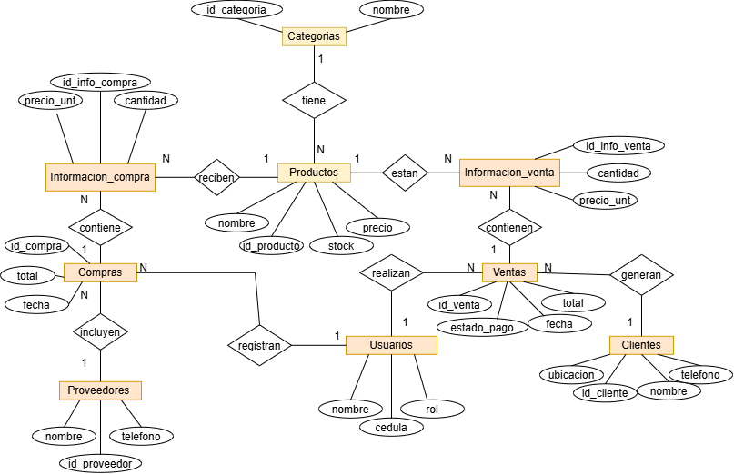

# Análisis de la Empresa

## 1. Datos Generales
- **Nombre:** Paraiso Distribuciones S.A.S.
- **Giro del negocio:** Distribución y comercialización de artículos de papelería, escolares y suministros de oficina.
- **Tamaño:** Pequeña empresa.
- **Clientes:** Personas naturales (estudiantes y particulares) y empresas (colegios, oficinas y papelerías).

## 2. Procesos Clave
- **Ventas:** Cotización → Pedido → Facturación → Entrega.
- **Compras:** Solicitud → Orden de compra → Recepción en bodega → Registro de pago.
- **Inventario:** Entradas, salidas y ajustes de inventario.

## 3. Entidades Identificadas (Tablas)
- Categorías
- Productos
- Compras
- Ventas
- Informacion_compra
- Informacion_venta
- Proveedores
- Usuarios
- Clientes

## 4. Preguntas Clave
- **¿Qué información se guarda de un cliente?** Se guarda identificación (cédula o NIT), nombre, teléfono y ubicación.
- **¿Qué información se guarda de un producto?** Se guarda identificación, nombre, precio y stock.
- **¿Cómo se relaciona una venta con el inventario?** Cuando se registra una venta, el sistema busca los productos y resta la cantidad al stock.

## 5. Diccionario de Datos (Mínimo 3 tablas)

### Tabla: Clientes
| Campo | Tipo | Descripción |
| :--- | :--- | :--- |
| id_cliente | BIGINT | Identificador único del cliente (PK) |
| nombre | VARCHAR(150) | Nombre o razón social del cliente |
| telefono | VARCHAR(20) | Número de contacto |
| ubicacion | VARCHAR(255) | Dirección o ciudad |

### Tabla: Productos
| Campo | Tipo | Descripción |
| :--- | :--- | :--- |
| id_producto | BIGINT | Identificador único del producto (PK) |
| nombre | VARCHAR(150) | Nombre del producto |
| precio | DECIMAL(12,2) | Precio de venta |
| stock | INTEGER | Cantidad disponible en inventario |

### Tabla: Ventas (Cabecera)
| Campo | Tipo | Descripción |
| :--- | :--- | :--- |
| id_venta | BIGINT | Identificador único de la venta (PK) |
| fecha | DATE | Fecha de la venta |
| total | DECIMAL(12,2) | Valor total de la venta |
| estado_pago | VARCHAR(50) | Estado (Pagado, Pendiente, etc.) |
| id_cliente | BIGINT | Clave foránea a Clientes (FK) |
| id_usuario | BIGINT | Clave foránea a Usuarios (FK) |

## 6. Diagrama Entidad-Relación (MER)
